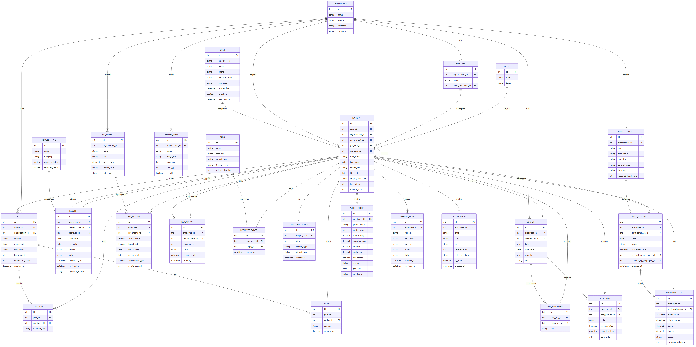

# HR Management System (HRMS)

[](https://github.com/Moha-sami/HR_system/actions)
[](https://github.com/Moha-sami/HR_system)
[](https://dotnet.microsoft.com/)
[](https://angular.dev/)
[](https://buy2-hrms.atlassian.net)
[](https://github.com/Moha-sami/HR_system/graphs/contributors)
[](./LICENSE)

An enterprise-grade open-source HR Management System built with **.NET 10 Clean Architecture** and **Angular 18+**. Buy2 HRMS features advanced shift scheduling engines, geofenced clock-in attendance, gamification points ledgers, and digital reward voucher stores.

---

## 📌 Project Milestones & Module Status

| Feature Module | Status | Notes |
| :--- | :---: | :--- |
| **Domain Layer** — 25 Entities (Employee, Role, Site, Shift, Points, Rewards, etc.) | ✅ Done | All entities + EF Core Configurations + Migrations |
| **Infrastructure Layer** — DbContext, JWT, Repositories, UoW, DB Seeder | ✅ Done | Full persistence + authentication pipeline wired |
| **Auth API** — Login, Password Reset | ✅ Done | JWT Bearer, OTP flow |
| **Employee Directory API** — CRUD, Search, Filter, Sort, Paginate, Export | ✅ Done | 16 endpoints complete |
| **Employee Performance API** — Overview, Metrics, Tasks | ✅ Done | Date-range filtering, rating labels |
| **Employee Attendance API** — Monthly Calendar View | ✅ Done | Punctuality score, lateness minutes |
| **Employee Points & Rewards API** — Ledger Summary, Transaction History | ✅ Done | Paginated, filterable |
| **Role Management API** — CRUD + Granular Permission Matrix | 🔄 In Progress | Entity done, endpoints pending |
| **Site & Branch Management API** — Geofence, MAC Whitelist, SOPs | 🔄 In Progress | Entity done, endpoints pending |
| **Advanced Scheduling Engine** — Pre-flight Validation, Publish | ⏳ Pending | Stub only |
| **Shift Market & Overtime Approvals** | ⏳ Pending | Query stub exists |
| **Points Automation Engine** — Lateness Deductions, Reward Redemption | ⏳ Pending | |
| **Rewards Catalog & Voucher Store** | ⏳ Pending | |
| **Executive Analytics Dashboard** | ⏳ Pending | |
| **Frontend (Angular 18+)** — All Modules | ⏳ Pending | TypeScript models scaffolded |

---

## ✅ What's Been Built (Backend API)

### Authentication
| Method | Route | Description |
| :--- | :--- | :--- |
| `POST` | `/api/v1/auth/login` | JWT login — returns Bearer token + employee profile |
| `POST` | `/api/v1/auth/password/reset` | Self-service password reset by email |

### Employee Directory
| Method | Route | Description |
| :--- | :--- | :--- |
| `GET` | `/api/v1/employees` | Paginated list — search, filter, sort by name/email/jobtitle/joindate |
| `GET` | `/api/v1/employees/export` | Download filtered employee list as CSV (UTF-8 BOM, Excel-safe) |
| `POST` | `/api/v1/employees/onboard` | Onboard single employee with job role & site assignment |
| `POST` | `/api/v1/employees/bulk-onboard` | Batch onboard employees; per-record partial failure tracking |
| `GET` | `/api/v1/employees/{id}` | Full profile — personal info, job, computed points/tasks/gifts stats |
| `PUT` | `/api/v1/employees/{id}/personal` | Partial update: name, phone, DOB, address, national ID, emergency contact |
| `PUT` | `/api/v1/employees/{id}/job` | Partial update: job role, manager, seniority, site, attendance type |
| `GET` | `/api/v1/employees/{id}/payroll` | Get payroll profile: salary type, work week, overtime rates, site assignments |
| `PUT` | `/api/v1/employees/{id}/payroll` | Upsert payroll profile — syncs `EmployeeSite` join table atomically |
| `DELETE` | `/api/v1/employees/{id}` | Soft delete (preserves all related historical records) |
| `POST` | `/api/v1/employees/{id}/documents` | Upload compliance document (PDF/JPG) — stores metadata |
| `POST` | `/api/v1/employees/{id}/violations` | Log disciplinary violation with severity & description |

### Employee Performance & Attendance
| Method | Route | Description |
| :--- | :--- | :--- |
| `GET` | `/api/v1/employees/{id}/performance/overview` | Weighted score, rating label, task stats, achievement badges, trend chart |
| `GET` | `/api/v1/employees/{id}/performance/metrics/{metricId}` | Detailed metric drill-down — monthly trends, submission history |
| `GET` | `/api/v1/employees/{id}/performance/tasks` | Assigned tasks filtered by status (`Todo`, `InProgress`, `Done`) |
| `GET` | `/api/v1/employees/{id}/attendance/calendar` | Monthly calendar — attendance rate, punctuality score, per-day status |

### Points & Gamification
| Method | Route | Description |
| :--- | :--- | :--- |
| `GET` | `/api/v1/employees/{id}/points/summary` | Current balance, total redeemed points, total rewards redeemed |
| `GET` | `/api/v1/employees/{id}/points/transactions` | Paginated ledger — filterable by type, rule key, date range |
| `POST` | `/api/v1/points/rules` | Create automation rule (trigger type, points value) |

### Job Role Management
| Method | Route | Description |
| :--- | :--- | :--- |
| `GET` | `/api/v1/jobs` | Paginated list — search, filter by department/work model/active status |
| `GET` | `/api/v1/jobs/{id}` | Full job role details — qualifications, workdays, employee counts |
| `GET` | `/api/v1/jobs/{id}/employees` | Paginated assigned employee roster with search filter |

### Sites (Stub Only)
| Method | Route | Description |
| :--- | :--- | :--- |
| `POST` | `/api/v1/sites` | Create branch site with coordinates & MAC whitelist |
| `GET` | `/api/v1/sites` | List all active sites |

### Roles (Stub Only)
| Method | Route | Description |
| :--- | :--- | :--- |
| `POST` | `/api/v1/roles` | Create custom role with permissions JSON |
| `DELETE` | `/api/v1/roles/{id}` | Soft delete role (409 Conflict if employees are bound) |

### Scheduling & Shift Market (Stub Only)
| Method | Route | Description |
| :--- | :--- | :--- |
| `POST` | `/api/v1/schedules/validate-draft` | Pre-flight validation (stub — returns mock result) |
| `GET` | `/api/v1/shift-market/open-shifts` | List open unassigned published shifts |
| `POST` | `/api/v1/shift-market/claims/{id}` | Claim a shift — creates `ShiftClaim` with Pending status |

---

## ⏳ What's Left

| Epic | Remaining Work | Effort |
| :--- | :--- | :--- |
| **RBAC / Roles** | List/Get/Update roles, full permission matrix, delete-with-reassignment flow | 3–4 days BE |
| **Site Management** | Full CRUD, region management, operational hours, preferred employees, SOP upload, employee & shift tabs | 4–5 days BE |
| **Scheduling Engine** | Real pre-flight engine (qualification + overlap + overtime checks), templates, publish with justification | 5–6 days BE |
| **Shift Market** | Qualification-filtered queries, overtime escalation, manager approve/reject desk | 2–3 days BE |
| **Points Automation** | Sliding lateness deduction engine, manual adjust with comment, overlap rule prevention | 3–4 days BE |
| **Rewards Store** | Catalog CRUD, Excel voucher bulk import parser, atomic redemption endpoint | 3–4 days BE |
| **Analytics / Notifications** | Executive KPI aggregations, broadcast notification by site/department | 2–3 days BE |
| **Clock-in / Geofence** | GPS + MAC/IP verification clock-in endpoint | 2 days BE |
| **All Frontend Modules** | Auth, Employee Profile, Site Map Picker, Drag-and-Drop Schedule Board, Shift Market, Rewards Store, Dashboard | 6–8 weeks FE |

**Estimated Total Remaining**: ~8–9 weeks with 3 BE + 4 FE developers.

---

## 🗄️ Database Architecture (ERD)

### Full Entity Relationship Diagram (v2 — 24 Entities)



> **24 entities** across 9 domains: Auth, Attendance, Shifts, Requests, Tasks, KPIs, Gamification, Social Feed, Payroll & Support.

*Detailed relationship documentation available at [`docs/ERD.md`](./docs/ERD.md).*

---

## 🏗️ Architecture & Project Structure

The codebase strictly adheres to **Clean Architecture** principles to ensure decoupled dependencies and maximum testability:

```
HR_system/
├── src/
│   ├── Buy2.Domain/           # Entities, Enums, Value Objects, Navigation Properties
│   ├── Buy2.Application/      # DTOs, Application Interfaces, CQRS Contracts, MediatR Handlers
│   ├── Buy2.Infrastructure/   # EF Core DbContext, Fluent API Configs, Repositories, JWT, Seeder
│   ├── Buy2.Api/              # REST API Controllers, Middleware, DI Container Setup
│   └── Buy2.Frontend/         # Angular 18 SPA (Signals, Standalone Components, Material UI)
├── docs/                      # ERD Diagrams, API Docs, Jira Import CSVs
│   ├── ERD_v2.png             # Full 24-entity ERD (auto-generated)
│   ├── API_ENDPOINTS.md       # Full REST endpoint reference
│   └── jira/                  # Jira import CSV task files
└── AVAILABLE_TASKS.md         # Master Contributor Task Backlog
```

---

## 📋 Jira Board & Automation Workflow

The project uses Atlassian Jira (**Space**: `Buy2 HRMS`, **Key**: `SCRUM`) integrated with GitHub Actions.

### Automation & Protection Rules:
1. **Branch & PR Naming**: Branch titles must include Jira Key (e.g. `SCRUM-101-create-employee-document-entity`).
2. **Auto-Transition to Done**: Merging a PR into `main` automatically transitions linked Jira cards to **Done**.
3. **CI/CD Build Checks**: Every PR triggers automated `.NET` builds and lint checks via GitHub Actions.

---

## 🚀 How to Contribute

We welcome team members and open-source contributors!

1. Open **[`AVAILABLE_TASKS.md`](./AVAILABLE_TASKS.md)** to view available tasks.
2. Pick an unassigned task card from the **Jira Sprint Board**.
3. Create a working git branch named after your Jira key (e.g., `SCRUM-101-create-employee-document-entity`).
4. Submit a Pull Request targeting `main`. Once merged, Jira auto-updates your task to **Done**!

---

## 💻 Local Setup & Development

### Prerequisites
- [.NET 10 SDK](https://dotnet.microsoft.com/)
- [Node.js 20+](https://nodejs.org/) & Angular CLI (`npm i -g @angular/cli`)
- Git

### Build & Run
```bash
# Clone repository
git clone https://github.com/Moha-sami/HR_system.git
cd HR_system

# Build .NET Solution
dotnet build HR_system.slnx

# Run API Backend
cd src/Buy2.Api
dotnet run

# Run Angular Frontend (in separate terminal)
cd src/Buy2.Frontend/Front
npm install
ng serve
```

---

## 🔗 Key Links & References
- **GitHub Repository**: [https://github.com/Moha-sami/HR_system.git](https://github.com/Moha-sami/HR_system.git)
- **Live API (Swagger)**: [https://hr-system-api.runasp.net](https://hr-system-api.runasp.net)
- **Figma UI/UX Design**: [BUY2 HRMS Figma Design](https://www.figma.com/design/JQ67DCkObzVjER8Safb5sw/BUY2-Junk-File?node-id=882-3040&p=f&t=GxfjGebSZZA9X7B0-0)
- **Jira Board**: `buy2-hrms.atlassian.net` (Key: `SCRUM`)
- **API Endpoints Docs**: [`docs/API_ENDPOINTS.md`](./docs/API_ENDPOINTS.md)

---

## 📄 License

This project is licensed under the **Apache License 2.0**.

```
Copyright 2026 Moha-sami & Buy2 HRMS Contributors

Licensed under the Apache License, Version 2.0 (the "License");
you may not use this file except in compliance with the License.
You may obtain a copy of the License at

    http://www.apache.org/licenses/LICENSE-2.0

Unless required by applicable law or agreed to in writing, software
distributed under the License is distributed on an "AS IS" BASIS,
WITHOUT WARRANTIES OR CONDITIONS OF ANY KIND, either express or implied.
See the License for the specific language governing permissions and
limitations under the License.
```

**What this means for contributors and users:**
- ✅ Free to use, modify, and distribute — commercially or privately
- ✅ **Patent protection**: Contributors grant you a royalty-free patent license — and lose it if they sue you for patent infringement
- ✅ You can include this code in closed-source products
- ⚠️ Must keep the copyright notice and license file
- ⚠️ Must document any significant changes you make to the source files

See the full license text in [`LICENSE`](./LICENSE).

---

## 👥 Contributors

Thanks goes to all our amazing contributors!

[](https://github.com/Moha-sami/HR_system/graphs/contributors)

*Want to contribute? Check out [`AVAILABLE_TASKS.md`](./AVAILABLE_TASKS.md) to pick an open task!*
