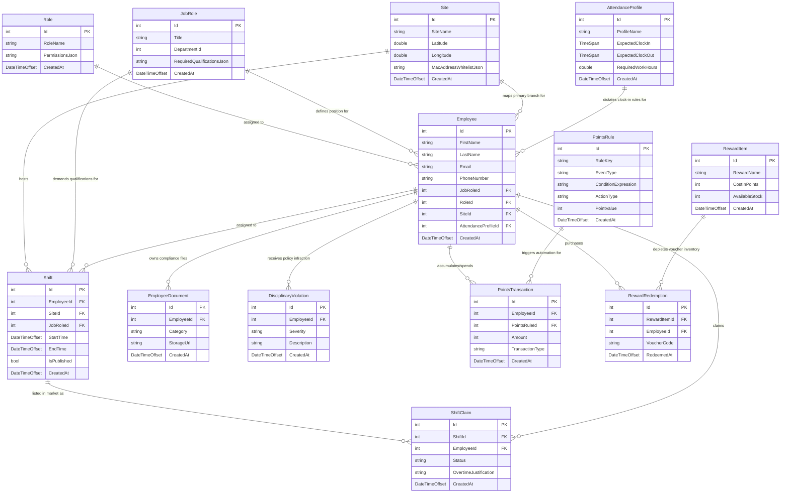

# Buy2 HRMS - Entity Relationship Diagram (ERD)

Visual Entity Relationship Diagram detailing the database schema, primary/foreign keys, and cardinalities for the Buy2 HR Management System.

---

## Key Schema Principles

1. **Primary Keys**: All entities inherit integer auto-increment primary keys (`Id PK`) from `BaseEntity`.
2. **Foreign Keys**: Soft entity mappings use `FK` integer identifiers (e.g. `SiteId`, `JobRoleId`, `EmployeeId`).
3. **JSON Metadata Columns**: Complex or dynamic rules (Permissions matrix, MAC whitelists, Qualification requirements) are stored as structured `JSON` strings for maximum schema flexibility.
