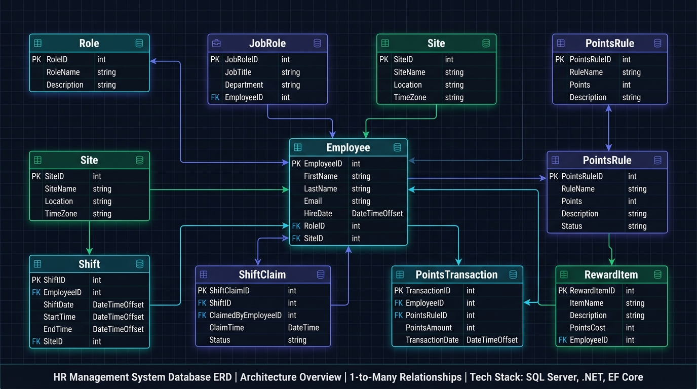
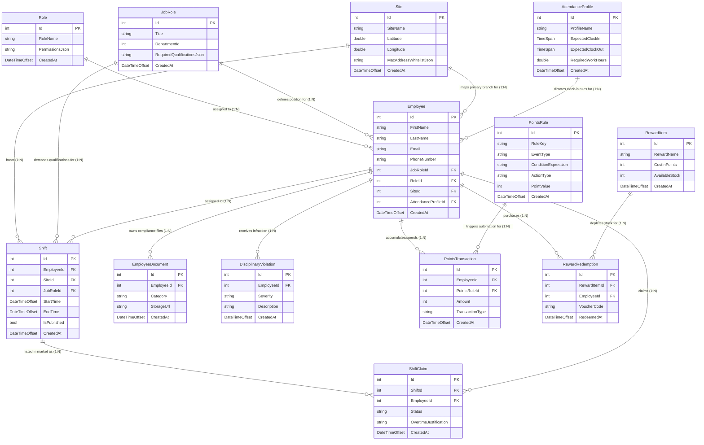

# Buy2 HRMS - Database ERD Architecture Specification

Complete database entity relationship documentation containing multi-view visual diagrams ordered from high-level clean overview to detailed architectural schematics.

---

## 1. High-Level Clean ERD Overview (Light Theme)

*Minimalist, non-intersecting relationship layout for fast high-level understanding.*

---

## 2. Explicitly Labeled Relationship Diagram (Dark Theme)

*Features explicit action labels on connecting arrows detailing entity interactions.*

---

## 3. Ultra-Detailed Schema Architecture Chart

*Full database schema layout with field data types, primary keys, and foreign keys.*

---

## Detailed Relationship Explanations

| Source Entity | Relationship Action (Verb) | Target Entity | Business Logic & Rules |
| :--- | :--- | :--- | :--- |
| **`Role`** | `assigned to (1:N)` | **`Employee`** | Role defines modular permission toggles assigned to multiple employees. |
| **`JobRole`** | `defines position for (1:N)` | **`Employee`** | Job position specifying required qualifications (POS, Management). |
| **`Site`** | `maps primary branch for (1:N)` | **`Employee`** | Mappings for geofence coordinates and MAC whitelists. |
| **`AttendanceProfile`** | `dictates clock-in rules for (1:N)` | **`Employee`** | Configures daily expected start/end times and break durations. |
| **`Site`** | `hosts (1:N)` | **`Shift`** | Physical store branch location where work shifts take place. |
| **`JobRole`** | `demands qualifications for (1:N)` | **`Shift`** | Shift requires employee to hold matching qualifications. |
| **`Employee`** | `assigned to (1:N)` | **`Shift`** | Work shift block assigned to an employee on the schedule board. |
| **`Shift`** | `listed in market as (1:N)` | **`ShiftClaim`** | Shift posted to the internal marketplace for claiming/swapping. |
| **`Employee`** | `claims (1:N)` | **`ShiftClaim`** | Teammate submitting a claim to cover a marketplace shift. |
| **`Employee`** | `owns compliance files (1:N)` | **`EmployeeDocument`** | Uploaded ID copies, medical leaves, and certificates. |
| **`Employee`** | `receives infraction (1:N)` | **`DisciplinaryViolation`** | Disciplinary violations logged by managers with attached evidence. |
| **`PointsRule`** | `triggers automation for (1:N)` | **`PointsTransaction`** | Rule logic evaluating clock-in delay to credit or debit wallet points. |
| **`Employee`** | `accumulates/spends (1:N)` | **`PointsTransaction`** | Ledger transactions modifying employee points balance. |
| **`RewardItem`** | `depletes stock for (1:N)` | **`RewardRedemption`** | Digital store voucher (Talabat, Noon) redeemed by employee points. |

---

## Interactive Mermaid Diagram

